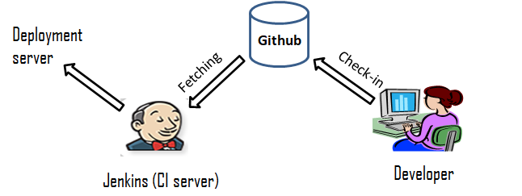

# Automated Web Development Environment

Directory "Website" consists of all the files of the Website that I used for creating a Web Development Environment by interating Git/Github, Jenkins and apache Web Server in Redhat 8. I have written a well documented article in my LinkedIn Handle explaining how we can create an web development environment using these technologies.To read my article on creating a complete end-to-end automated web development environment where you can create your websites as well as deploy you website <a href="https://medium.com/@adityapathak033/how-to-create-a-web-development-environment-integrating-git-github-jenkins-and-apache-web-server-8fb6960b33cd">click here.</a>
  

Note : The website used in this, is a demo website downloaded from <a href="https://trendytheme.net/best-free-html-resume-templates-to-download/">here.</a>
